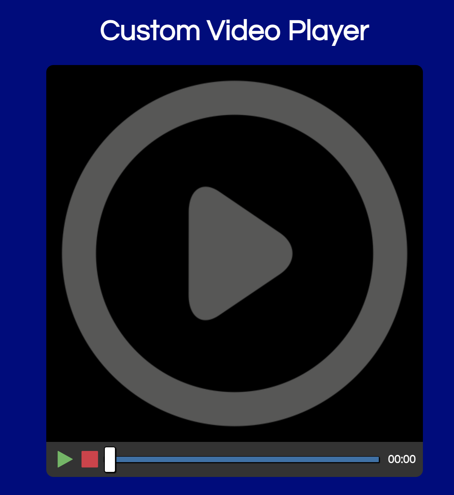
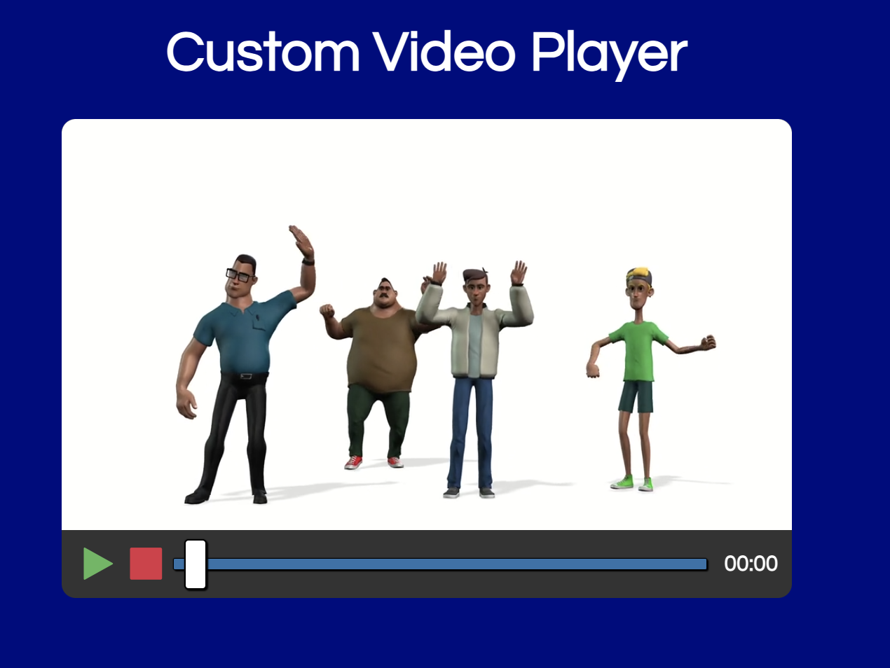

#Custom Video Player

##Description
This is a custom video player that I built using HTML, CSS, and JavaScript. It has a custom design and functionality that allows users to play, pause, and adjust the volume of the video. The video player also has a progress bar that shows the current time of the video and allows users to skip to different parts of the video.

